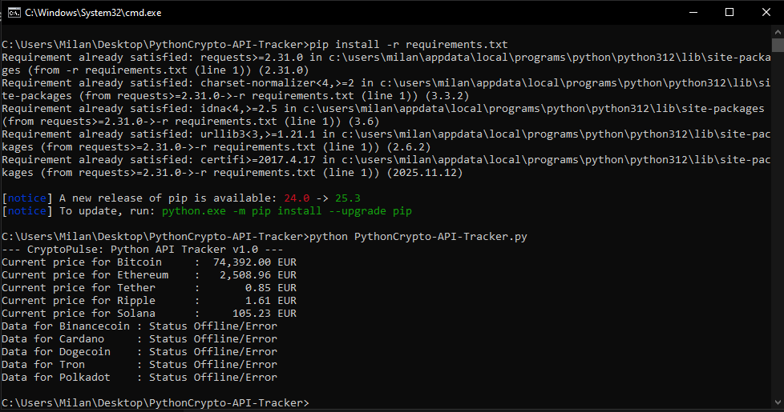

# Python Crypto API Tracker v1.0

## 📝 Description
This is a professional Python-based cryptocurrency tracking tool that integrates with the **CoinGecko API**. It demonstrates core QA Engineering principles, including API lifecycle management, data validation, and robust error handling.

## 🧪 QA Engineering & Testing Highlights
This project was built with a focus on software quality and reliability:
- **API Robustness**: Validates HTTP status codes (200 OK) before processing data.
- **Data Integrity**: Implements type-checking (`isinstance`) to verify that the price data is a number before formatting.
- **Negative Testing**: Includes logic to handle invalid coin IDs and empty JSON keys gracefully.
- **Error Management**: Uses `try-except` blocks to manage network-level exceptions such as timeouts or DNS failures.

## 🛠 Tech Stack
- **Language**: Python 3.x
- **Libraries**: `requests` (v2.31.0 or newer)
- **API Source**: [CoinGecko API](https://www.coingecko.com/en/api)

## ⚙️ Installation & Usage
1. **Clone the repository**:

   git clone [https://github.com/Milannba23/Python-Crypto-API-Tracker.git](https://github.com/Milannba23/Python-Crypto-API-Tracker.git)

## 📸 Project Preview

### Real-time Terminal Output
Below is the live execution of the script showing how it fetches market data:

